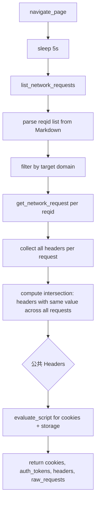

## 用户需求

### 1. 存储重构为 Header + Cookie 双通道

当前存储仅支持 Cookie + auth_tokens（来自 localStorage/sessionStorage），需要新增独立的 Header 存储通道。抓取后数据格式为 `{cookies, auth_tokens, headers, raw_requests}`，其中 headers 是多个网络请求中"不变"的公共请求头，raw_requests 是原始请求头列表。

### 2. 通过 CDP Network 域捕获 Request Headers

在页面加载后、执行 JS 采集 Cookie 之前，通过 chrome-devtools-mcp 的 `list_network_requests` 和 `get_network_request` 工具获取页面发出的所有网络请求的 Request Headers。

### 3. Header 分析：提取"不变"的公共头

综合多个 Ajax 请求和静态资源请求，分析哪些 Request Header 在多个请求中保持一致（如 Authorization、User-Agent、Accept-Language 等），将这些公共 Header 存储。同时保留 raw request headers 完整列表，方便用户查看全部原始请求。

### 4. 全链路更新

CLI（grab/get/list）、Web UI（站点详情面板）、存储编解码、测试全覆盖。

## 技术栈

- Python 3.13 + 现有项目架构
- MCP JSON-RPC 通信层（chrome-devtools-mcp）
- Romek Vault 键值存储（前缀编码方案）
- FastAPI + HTMX + SSE（Web UI）
- pytest + unittest.mock（测试）

## 实现方案

### 核心策略

**CDP 网络请求捕获流程**（在 `_grab_cookies_impl` 中插入，位于 navigate 之后、evaluate_script 之前）：

```
navigate_page → sleep(5s，等待页面加载和网络请求) → list_network_requests
→ 过滤目标域名的请求 → 批量 get_network_request → 分析公共 Header
→ evaluate_script（采集 Cookie 等，现有逻辑）
```

**Header 分析算法**：

1. 调用 `list_network_requests` 获取请求列表（Markdown 表格格式）
2. 解析表格提取 reqid 列表
3. 对每个 reqid 调用 `get_network_request`，获取完整请求详情
4. 过滤：仅保留目标域名匹配的请求
5. 跨请求比较：Header 键出现的所有请求中，值完全相同 → 标记为"公共 Header"
6. 输出：

- `headers`：`{key: value}` 公共不变 Header
- `raw_requests`：`[{url, method, headers: {key: value}}]` 原始请求列表（限前 20 条防止数据过大）

**Vault 前缀编码方案**（扁平键值存储）：

- Cookie：`{name} = {value}`（现有，无前缀）
- Auth Token：`__auth__ls:{key}` / `__auth__ss:{key}`（现有）
- Header：`__hdr__{name} = {value}`（新增）
- Raw Requests：`__raw__requests = JSON字符串`（新增，单键存整个列表）

**向后兼容**：

- `get_site` / `list_sites` 中 `_decode` 函数自动忽略了不认识的键，旧数据（无 `__hdr__` 和 `__raw__` 前缀）读取时 headers/raw_requests 为空列表
- `store_site` 接受 `data` dict，其中 headers 和 raw_requests 可选（旧调用方不传则忽略）

### 性能考量

- `get_network_request` 按 reqid 逐个调用，限制了前 20 个目标域名请求（避免过多 JSON-RPC 调用）
- `raw_requests` 存储为单个 JSON blob（Vault 单键），减少 Vault 条目数
- Markdown 解析使用正则匹配（轻量、无额外依赖）

### 关键设计决策

- 复用现有 `_jsonrpc_send` + `_extract_result` 模式调用 MCP 工具
- 新增 `_parse_network_list(text)` 和 `_parse_network_request(text)` 解析 Markdown 表格返回
- `_encode_headers` / `_decode_headers` 与现有 `_encode_auth_tokens` / `_decode_auth_tokens` 并行，不互相耦合
- `AUTH_PREFIX` 同级新增 `HDR_PREFIX = "__hdr__"` 和 `RAW_PREFIX = "__raw__"`

## 架构设计



## 目录结构

```
d:/github/session-cli/
├── core/
│   ├── mcp.py              # [MODIFY] 新增 _grab_network_headers(), _parse_network_list_table(), _parse_network_request_detail(); 新增 HDR_PREFIX/RAW_PREFIX 常量; 修改 _grab_cookies_impl() 插入网络头捕获步骤
│   ├── mcp_manager.py      # [MODIFY] 新增 grab_network_headers 的 managed 包装（可选，复用 _grab_cookies_impl 的扩展流程）
│   ├── session.py          # [MODIFY] 新增 _encode_headers()/_decode_headers() 编码函数; 修改 store_site()/get_site()/list_sites() 支持 headers + raw_requests 字段
│   ├── vault.py            # [UNCHANGED] 无需修改
│   └── __init__.py         # [UNCHANGED] 公共 API 不变
├── main.py                 # [MODIFY] cmd_grab/cmd_get/cmd_list 输出新增 headers + raw_requests 信息
├── server.py               # [MODIFY] _run_grab_task 完成提示包含 header 计数
├── templates/
│   └── index.html          # [MODIFY] toggleDetail() 渲染 Header 详情区 + Raw Requests 折叠面板
└── tests/
    ├── conftest.py          # [MODIFY] 新增 sample_network_list_md / sample_network_request_md / sample_grab_with_headers 等 fixtures
    ├── test_mcp.py          # [MODIFY] 新增 TestParseNetworkList / TestParseNetworkRequest / TestGrabNetworkHeaders 测试类
    └── test_session.py      # [MODIFY] 新增 TestHeaderEncodeDecode 测试类
```

## 关键代码结构

### 新增返回数据结构

```python
# grab_cookies() / grab_cookies_managed() 返回格式升级：
{
    "cookies": {"token": "abc", "uid": "123"},
    "auth_tokens": [
        {"source": "localStorage", "key": "auth_token", "value": "Bearer xxx"}
    ],
    "headers": {                          # 新增：公共不变 Header
        "Authorization": "Bearer xxx",
        "User-Agent": "Mozilla/5.0...",
        "Accept-Language": "zh-CN,zh;q=0.9"
    },
    "raw_requests": [                     # 新增：原始请求列表
        {"url": "https://example.com/api/me", "method": "GET",
         "headers": {"Authorization": "Bearer xxx", "Accept": "application/json"}}
    ]
}
```

### Vault 编码键名前缀

- `__auth__ls:key` / `__auth__ss:key` — auth tokens（现有）
- `__hdr__HeaderName` — 公共 Header（新增，如 `__hdr__Authorization`）
- `__raw__requests` — 原始请求列表 JSON blob（新增）