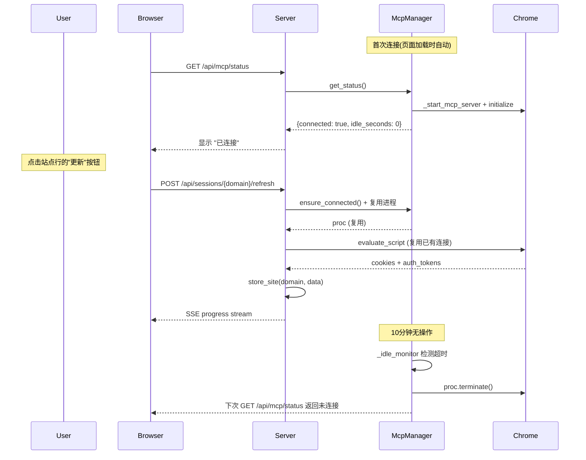

## 用户需求

### 需求 1：站点列表增加"立即更新"按钮

在 Web UI 的"已存储站点"列表中，每个站点行新增一个"更新"按钮。点击后对该站点域名重新执行完整的 Cookie + 认证凭据抓取流程，结果直接覆盖已有 Vault 条目，无需用户手动输入域名。进度复用现有的 SSE 进度条机制。

### 需求 2：MCP 长连接 + 连接状态管理

- Chrome DevTools MCP 连接后默认保持连接，不再每次抓取都创建新进程
- 页面上显示当前 MCP 连接状态（已连接 / 未连接 / 空闲时长）
- 用户可从页面手动连接或断开 MCP
- 若持续 10 分钟无操作，自动断开 MCP 进程

## 核心功能

- 新增 `McpManager` 单例，管理 MCP 进程生命周期（连接/断开/空闲超时/通信锁）
- 连接状态栏显示在页面顶部标题区，含状态徽标 + 连接/断开按钮
- 站点列表每行新增"更新"按钮，点击后触发后台异步 re-grab
- CLI 模式（`main.py`）保持原有每次独立连接行为，不与 Web 服务端共享 MCP 实例

## 技术栈

- 后端：Python + FastAPI（现有 server.py）+ threading（现有并发模型）
- 前端：HTML + HTMX（现有）+ Vanilla JS（现有 SSE 模式）
- MCP 通信：chrome-devtools-mcp@latest（通过 subprocess + stdin/stdout JSON-RPC）

## 实现方案

### 架构策略

采用"**单例 McpManager + 后台空闲监控线程**"模式，将 MCP 进程所有权从 `grab_cookies()` 函数级提升到模块级。

```
Before (每次新建):
  grab_cookies() → _start_mcp_server() → ... → finally:terminate()

After (长连接复用):
  McpManager.get_instance().ensure_connected()  ← 首次自动连接
  grab_cookies_via_manager()                     ← 复用已有进程
  McpManager._idle_monitor()                     ← 后台线程,10分钟无操作自动断开
```

### McpManager 设计

```
McpManager (单例, threading.Lock)
├── _proc: subprocess.Popen | None        ← MCP 进程句柄
├── _comm_lock: threading.Lock            ← 串行化 stdin/stdout 读写
├── _last_activity: float                 ← 上次操作时间戳
├── _idle_timeout: float = 600            ← 10 分钟
├── _monitor_thread: Thread | None        ← 空闲监控线程
├── _monitor_running: bool                ← 监控线程开关
│
├── connect()                             ← 启动 MCP 进程 + 初始化握手
├── disconnect()                          ← terminate + kill + 停监控线程
├── ensure_connected()                    ← 自动连接（幂等）
├── is_connected() → bool                 ← 进程存活检查 (poll() is None)
├── get_status() → dict                   ← {connected, idle_seconds, uptime}
├── _reset_idle()                         ← 记录 _last_activity = time.time()
├── _start_monitor()                      ← 启动后台监控线程
├── _stop_monitor()                       ← 停止后台监控线程
└── _idle_monitor_loop()                  ← 每 30s 检查，超时自动 disconnect()
```

### grab_cookies 重构策略

保留现有 `grab_cookies()` 函数签名不变（CLI 兼容）。新增内部函数 `_grab_via_manager()` 供 server 调用：

- **CLI 路径**：`grab_cookies()` 保持独立的 `_start_mcp_server()` + `finally: terminate()` 行为不变
- **Server 路径**：`_run_grab_task()` 改为调用 `grab_cookies_managed()`，该函数从 `McpManager` 获取复用的进程

通信锁确保同一时刻只有一个抓取任务使用 MCP 进程的 stdin/stdout。

### 空闲监控线程

```python
def _idle_monitor_loop(self):
    while self._monitor_running:
        time.sleep(30)
        if self._proc and self._proc.poll() is not None:
            # 进程已意外退出
            self._cleanup()
            break
        if time.time() - self._last_activity > self._idle_timeout:
            self.disconnect()
            break
```

### 数据流



## 实现细节

### 通信锁机制

`McpManager._comm_lock` 是 `threading.Lock`，在调用 `_jsonrpc_send()` 前后加锁，确保同一线程独占 stdin/stdout。当前系统是单线程抓取（`_run_grab_task` 由用户操作触发），锁主要防止并发抓取时的响应串扰。

### 性能优化

- 复用进程省去每次 ~5 秒的 npx 启动 + 握手开销
- 空闲监控线程 sleep 30s，CPU 开销可忽略

### 向后兼容

- `grab_cookies()` 公共函数签名和行为完全不变
- 现有 SSE 进度机制不变（只增不减）
- CLI 模式（`main.py`）不依赖 McpManager，行为不变
- Vault 存储格式不变

### 错误处理

- `ensure_connected()` 在进程异常退出时自动重连（最多 1 次重试）
- `disconnect()` 容忍进程已退出，不抛异常
- Server 端 `_run_grab_task` 捕获 McpManager 连接失败，通过 SSE 推送错误

## 设计概要

在现有暗色主题基础上增加两个 UI 元素：

1. 页面顶部标题栏旁新增 MCP 连接状态指示区
2. 站点列表每行新增"更新"按钮

## 连接状态栏设计

位置：标题 h1 右侧，紧跟版本 badge
布局：水平排列的状态徽标 + 连接/断开按钮组

- 已连接：绿色徽标"已连接" + 灰色副文本显示空闲时长（如"空闲 2m30s"）+ "断开"按钮（红色边框）
- 未连接：橙色徽标"未连接" + "连接"按钮（蓝色）
- 连接中：蓝色徽标"连接中..." + 加载动画

按钮使用现有 `.btn` + `.btn-sm` 样式类。

## 站点列表"更新"按钮

每个站点行的操作区域增加一个"更新"按钮，放置在"查看"按钮左侧：

- 样式：`.btn-sm` 蓝色边框透明背景，Hover 时填充蓝色
- 图标：文字"更新"
- 点击后复用 `startGrab()` 逻辑，自动填充该站点域名
- 更新期间该按钮显示 loading（disabled + 文字变"更新中..."）