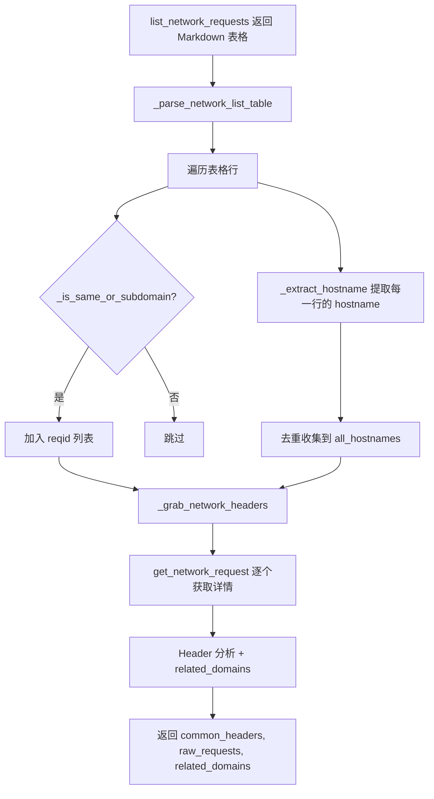

## 用户需求

### 1. 子域名精确匹配修复

当前 `domain.lower() in url.lower()` 子串匹配存在误匹配（如 `example.com` 会错误匹配 `notexample.com`、`example.com.evil.org` 等）。需要改为精确的「hostname == domain 或 hostname.endswith(".domain")」判断，使 `api.example.com`、`cdn.static.example.com` 能正确匹配，而非子域名的 URL 不误匹配。

### 2. 域名关系追踪

打开 A 站点（如 `example.com`）时，浏览器会同时向 B、C、D 等多个第三方域名（如 `api.example.com`、`cdn.cloudflare.com`、`analytics.google.com`）发起网络请求。需要记录此关系：

- 存储为独立的 `related_domains` 列表（去重后的 hostname 字符串数组）
- 查询 A 站点时，一并返回 `related_domains`
- **仅记录一层**，不递归查询 B/C/D 自己的 related_domains
- 包括目标域名的子域名（`api.example.com`）和完全不同的第三方域名（`google.com`）

## 核心功能

- `_extract_hostname()` — 从 URL 文本提取纯 hostname
- `_is_same_or_subdomain()` — 精确的相同域名/子域名判断
- `_grab_network_headers()` 从表格中收集所有唯一 hostname 作为 `related_domains`，返回值从二元组扩展为三元组
- Vault 编码新增 `__rel__domains` → JSON list，与现有 `__auth__`、`__hdr__`、`__raw__` 前缀并存
- CLI `cmd_get` 输出新增"关联域名"区域
- Web UI `toggleDetail()` 新增关联域名标签展示

## 技术栈

- Python 3.13 + 现有项目架构
- MCP JSON-RPC（chrome-devtools-mcp）
- Romek Vault 扁平键值前缀编码
- FastAPI + HTMX + SSE（Web UI）
- pytest（测试）

## 实现方案

### 核心策略

**域名匹配升级**：新增两个辅助函数，从子串匹配改为精确 hostname 匹配。

**related_domains 收集**：在 `_parse_network_list_table` 中，不仅过滤目标域名的 reqid，同时用 `_extract_hostname` 从表格每一行提取 hostname 并去重收集。`_grab_network_headers` 将这些收集到的 hostname 作为 `related_domains` 返回。

**Vault 编码**：沿用现有前缀编码模式，新增 `REL_PREFIX = "__rel__"`，`_encode_related` 将列表编码为 `{"__rel__domains": "[...]"}` 单键 JSON blob，`_decode_related` 解码还原。

### 架构设计



### 关键数据结构

```python
# _grab_network_headers 新返回值
(common_headers: dict, raw_requests: list, related_domains: list[str])

# _grab_cookies_impl 新返回
{
    "cookies": {...},
    "auth_tokens": [...],
    "headers": {...},
    "raw_requests": [...],
    "related_domains": ["api.example.com", "cdn.cloudflare.com", "google.com"]
}

# Vault 编码新增键
"__rel__domains": '["api.example.com", "cdn.cloudflare.com"]'
```

### 修改文件清单

| 文件 | 改动 |
| --- | --- |
| `core/mcp.py` | 新增 `_extract_hostname()`、`_is_same_or_subdomain()`；修改 `_parse_network_list_table()` 过滤逻辑并返回额外 hostname 集合；修改 `_grab_network_headers()` 返回三元组；修改 `_grab_cookies_impl()` 两处 return 增加 `related_domains`；新增 `REL_PREFIX` 常量 |
| `core/session.py` | import `REL_PREFIX`；新增 `_encode_related()`、`_decode_related()`；修改 `store_site()`/`get_site()`/`list_sites()` 支持 `related_domains` 字段 |
| `main.py` | `cmd_grab` 展示 related_domains 计数；`cmd_get` 新增关联域名列表输出 |
| `templates/index.html` | `toggleDetail()` 新增关联域名区域 |
| `tests/test_mcp.py` | 新增 `TestExtractHostname`、`TestIsSameOrSubdomain` 测试类；更新 `TestParseNetworkListTable` 验证子域名匹配 |
| `tests/test_session.py` | 新增 `TestRelatedDomainsEncodeDecode` 测试类；新增 `test_store_with_related` 集成测试 |
| `tests/conftest.py` | 新增 `sample_grab_with_related_domains` fixture |